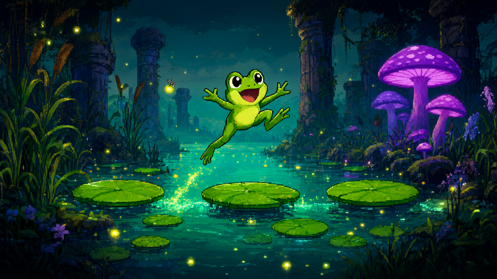

# Ribbit's Big Adventure (RBA)



A high-performance retro platformer starring Ribbit the frog, built with multi-platform game engines and backed by autonomous AI level-design intelligence.

---

## Overview

Ribbit's Big Adventure follows Ribbit across vibrant swamp ecosystems, treacherous canopies, glowing fungal groves, and ancient sunken ruins. The game combines classic 16-bit momentum-based platforming mechanics with procedural level balancing and variable jump physics.

The project encompasses two coordinated implementations:
1. **Web Edition (`web/`)**: Browser-accessible implementation featuring both a 2D Phaser engine and a 3D Three.js diorama mode.
2. **Godot 4 Native Edition (`godot/`)**: High-performance desktop version built in Godot 4, targeting optimal hardware rendering with OpenGL compatibility and nearest-neighbor pixel filtering.

---

## World & Level Stages

- **Level 1: Lilypad Lagoon**: Introduction to variable-height leap mechanics, floating foliage, and water hazards.
- **Level 2: Cattail Canopy**: Vertical platforming with swaying stalks, descending reed drops, and momentum management.
- **Level 3: Mushroom Mire**: Fungal trampolines, bounce pads, and tight platforming leaps.
- **Level 4: The Sunken Citadel**: Crumbling stone columns, darting underwater predators, and boss arena encounters.
- **Level 5: Firefly Marsh**: Algorithmically synthesized night marsh illuminated by drifting firefly swarms and bioluminescent flora.

---

## Core Gameplay Mechanics & Controls

### Mechanics
- **Variable Jump Height**: Tap for quick hops or hold for maximum leap arcs.
- **Coyote Time & Jump Buffering**: Generous input forgiveness when running off ledge edges and queuing landing jumps.
- **Squash & Stretch**: Procedural sprite deformation responsive to velocity changes and impact landings.
- **Momentum Bouncing**: Enhanced vertical launch velocity off fungal springs and bouncy lilypads.
- **Tongue Attack**: Directional tongue strike to snare fireflies and neutralize swamp pests.

### Controls (Web & Godot)
- **Move Left / Right**: `A` / `D` or `Left` / `Right Arrow`
- **Jump**: `Space` / `W` / `Up Arrow` (hold to leap higher)
- **Tongue Attack / Interact**: `J` / `X` / `Enter`
- **3D Camera Rotate (Web 3D mode)**: Left-click and drag with mouse (OrbitControls)

---

## Autonomous Level Intelligence (JEV)

Levels in Ribbit's Big Adventure are verified by an autonomous AI game design and QA framework located in `web/tools/level_intelligence`:
- **Kinematic Jump Modeling**: Simulates exact parabolic jump curves, terminal velocity, and horizontal momentum to guarantee every platform distance is mathematically reachable.
- **Monte Carlo Playtesting**: Runs hundreds of automated playthroughs per level to surface rage-quit gaps, unfair vertical ascents, or blind falls.
- **Procedural Generation**: Algorithmically generates balanced level stages based on cadence, recovery ledges, and difficulty curves.

---

## Art Pipeline & Graphical Overhaul Roadmap

Ribbit's Big Adventure is currently undergoing a full graphical overhaul leveraging local AI generation workflows via **ComfyUI** and **Qwen Image 2.1**:

- **Sprite Sheets**: High-detail 48x48 and 64x64 multi-frame animation sheets for Ribbit (idle, throat puff, leap, apex tuck, land, dive, tongue lash).
- **Environment Tilesets**: Distinct thematic tilesets for mossy mud banks, hollowed cypress logs, bioluminescent fungi, and moss-draped masonry.
- **Multi-Layer Parallax Backgrounds**: Multi-plane atmospheric backdrops featuring distant canopy silhouettes, drifting swamp mist, and glowing firefly particles.
- **Boss Entities**: Multi-phase swamp leviathan and boss monster sprites with directional telegraph animations.

Workflows and generated sprite sheets will be deposited into the asset directories as rendering passes conclude.

---

## Project Structure

```
RBA/
├── godot/                      # Godot 4 Native Desktop Engine
│   ├── assets/
│   │   ├── sprites/            # Pixel art sprite textures
│   │   ├── audio/              # Sound effects and music
│   │   └── fonts/              # Retro typography
│   ├── scenes/
│   │   ├── main.tscn           # Main gameplay scene
│   │   ├── player.tscn         # Ribbit CharacterBody2D entity
│   │   └── level5_data.json    # AI-generated level layout
│   ├── scripts/
│   │   └── player.gd           # Kinematic character controller
│   ├── project.godot           # Godot project configuration
│   └── run.sh                  # One-click launcher script
│
├── web/                        # Web Edition (Phaser + Three.js)
│   ├── index.html              # 2D Phaser platformer client
│   ├── 3d.html                 # 3D Three.js diorama client
│   ├── phaser.min.js           # Phaser 2D library
│   ├── server.py               # Lightweight Python dev server
│   ├── server.js               # Node.js dev server
│   ├── js/
│   │   ├── player.js           # Player state machine and movement
│   │   ├── enemies.js          # Enemy AI routines
│   │   ├── levels.js           # Stage geometries and placements
│   │   ├── assets.js           # Procedural sprite canvas generator
│   │   ├── audio.js            # WebAudio procedural synthesizer
│   │   ├── game.js             # Main Phaser scene loop
│   │   └── game3d.js           # Three.js 3D diorama renderer
│   └── tools/
│       └── level_intelligence/ # JEV kinematic physics & simulation suite
│
├── .gitignore                  # Git ignore rules
└── README.md                   # Repository documentation
```

---

## Quick Start Guide

### Playing Online (Vercel Deployment)
The Web Edition is pre-configured with `vercel.json` for zero-configuration 1-click hosting on Vercel:
1. Import `github.com/spinz/RBA` into your Vercel account.
2. Deployment is fully automatic with root routing:
   - Root URL (`/`): 2D Retro Platformer with mobile touch controls and CRT toggle.
   - 3D Diorama (`/3d`): 3D Three.js interactive swamp diorama.
3. Open the generated Vercel URL on mobile, tablet, or desktop to play anywhere without setup.

### Running the Web Edition Locally
1. Navigate to the `web/` directory:
   ```bash
   cd web
   ```
2. Start the local development server:
   ```bash
   python3 server.py
   # or:
   python3 -m http.server 8080
   ```
3. Open your browser:
   - 2D Platformer: `http://localhost:8080/`
   - 3D Diorama: `http://localhost:8080/3d.html`

### Running the Godot 4 Edition
Requirements: Godot 4.x installed on your system.

1. Launch directly from terminal:
   ```bash
   ./godot/run.sh
   # or:
   godot --path godot
   ```
2. To open in the Godot Editor:
   ```bash
   ./godot/run.sh editor
   # or:
   godot -e --path godot
   ```

---

## License

All rights reserved. Ribbit's Big Adventure (RBA) proprietary assets and game logic.
